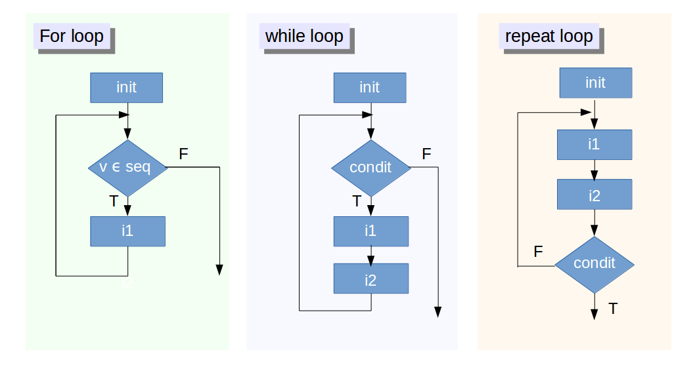

```{r include=FALSE}
library(knitr)
knitr::opts_chunk$set(warning = TRUE,
                      echo = TRUE,
                      message = TRUE,
                      # fig.align='center',
                      cache=TRUE)
```


## Outline

- Overview
- Data Structures
- Function
- Control Flow
- Miscellaneous
- References

# Overview

## What is R

- A free software environment for statistical computing and graphics
- An open source version of S language
- An interpreted language builded with C, C++, Fortran and R
- A general-purpose scripting language
- Multi-paradigm
    - Procedual, Object-Oriented and Functional


## Why R

<div class="columns-2">

- It's free
- High-level functions/packages for analytic tasks
- Most popular analytic tool
- Communities with Statisticians, Analysts and Data Scientists
- To communicated with analyst / engineer
- Intergrated environment for reproducible research


[KDnuggets Poll 2015](http://www.kdnuggets.com/2015/05/poll-r-rapidminer-python-big-data-spark.html)

</div>


## Installation

You can use R in various environments:

- [Windows](https://www.youtube.com/watch?v=Ohnk9hcxf9M)  
    Download [base](https://cran.rstudio.com/bin/windows/base/) and 
    [Rtools](https://cran.rstudio.com/bin/windows/Rtools/)(optional) then install

- [Mac](https://www.youtube.com/watch?v=uxuuWXU-7UQ)  
    Download [R-x.x.x.pkg](https://cran.rstudio.com/bin/macosx/) and install
- Linux  
    You may use apt-get or yum to install your R environment  
    - [Ubuntu](https://cran.r-project.org/bin/linux/ubuntu/README)
    - [Red Hat](https://cran.r-project.org/bin/linux/redhat/README)

Using Linux or Mac may save your time with encoding issue.


## Rstudio

[Rstudio](https://www.rstudio.com/) 
is a powerful IDE that make you more confortable with R.


- [Rstudio Desktop](https://www.rstudio.com/products/rstudio/download/)

    A Rstudio IDE on your local machine. Download the installer of your OS and install it.
    [Here](https://www.youtube.com/watch?v=bM7Sfz-LADM) 
    is a video from 
    [Roger Peng](http://www.biostat.jhsph.edu/~rpeng/)
    about how to install RStudio on mac

- [Rstudio Server](https://www.rstudio.com/products/rstudio/download-server/)

    A Rstudio IDE Server on Linux platform. Download the installer and follow the instruction.


## How to get help

- `?`: Access ducument in R console
- `??`: Search the halp system
- google with appropriate keyword. For example:
    - R {package name}
    - R {algorithm name}
- Forum
    - [Taiwan R user Group](http://www.meetup.com/Taiwan-R/)  
      A free R/data analysis user group in Taiwan
    - [Stack Overflow](http://stackoverflow.com/questions/tagged/r)  
      A question and answer site for programmers
    - [PTT R_Language board](https://www.ptt.cc/bbs/R_Language/index.html)  
      A bbs forum for R in Taiwan


## Assignment

You can use `<-` or `=` to assign a value to a variable.

```{r}
x <- 9.8
y = 689
z = x * 2 + y - (5 / 3^2)
z
```

Most [Programming Style Goude](http://adv-r.had.co.nz/Style.html)
would recommend using `<-` for assignment.

Please visit [here](http://adv-r.had.co.nz/Vocabulary.html) for more vocabulary in R.


## Working Environment

Using `getwd`/`setwd` to get/set your working directory.

```{r}
wd = getwd()
setwd("img")
getwd()
setwd(wd)
getwd()
```

If you [using Projects](https://support.rstudio.com/hc/en-us/articles/200526207-Using-Projects),
RStudio will change working directory for you automatically.


## Exercise: Hello R/RStudio

Let's have fun with R/RStudio


# Data Structures

## Basic Data Structure

Vector, Matrix, Array, List and Data frame are the most basic data structure in R.
These data structures can be mapped into a table according to:

- dimension
- Homogeneous or Heterogeneous of data type


<br> | Homogeneous     | Heterogeneous
---  | --------------- |-------------
1d   | Atomic vector   | List
2d   | Matrix          | Data frame
nd   | Array	


## Vector

Vector is a basic data structure in R. 
A scalar is a vector of length 1.


<div class="columns-2">

```{r}
v1 <- c(1:10)
v1
is.vector(v1)
length(v1)
s1 <- 2
s1
is.vector(s1)
length(s1)
```

</div>


## Type of Vector

Vector can contains several kinds of type.
Type describes how the object is stored in memory.
Elements in a vector will convert into looser types.

<div class="columns-2">

```{r}
logical_v = c(TRUE, FALSE, T, F)
typeof(logical_v)

int_v <- c(2L, 3L, 4L)
typeof(int_v)

numeric_v <- c(2.5, 3, pi)
typeof(numeric_v)

character_v = c("apple", "banana", 1)
typeof(character_v)
```

</div>


## Calculation with vector

Vectors can be calculated in the sense of [Array Programming](https://en.wikipedia.org/wiki/Array_programming).

```{r}
x <- 9.8
v1 <- 1:10
v1 * x
v2 <- c(rep(2, 5), rep(3,5))
v2
v1 + v2
```


## Recycle

If you calculate tow vectors with different length, 
the shorter vector will be recycled with the longer vector.

```{r}
v3 <- c(2, 3)
v1^v3
v4 <- c(2, 3, 4)
v1*v4
```


## Factor

A factor is a vector that can contain only predefined values, 
and is used to store categorical data.
Factors are widely used in various statically function(Ex: Regression, graphics, table) in R.

```{r}
gender <- c("Male", "Female", "Female", "Male")
gender <- factor(gender)
gender
```

<div class="columns-2">

```{r}
as.integer(gender)
as.character(gender)
```

</div>


## Named vector

A vector can have a name attribute.

```{r}
v5 <- c(1.2, 5, 8 , 12, 4.3, TRUE)
v5
names(v5) <- c("a", "b", "c", "d", "e", "f")
v5
attributes(v5)
```


## Subsetting: vector

you can subset a vector in various ways.

<div class="columns-2">

```{r}
v5[c(5, 2, 6)]
v5[-c(1, 3)]
v5[c("a", "f", "c")]
v5[c(T, F, F, T, F, T)]
v5[v5 >=7.5]
v5[v5 == max(v5)]
```

</div>


## Matrix

Matrix is a 2-dimenstion array. 
You can have various 
[matrix operation in R](http://www.statmethods.net/advstats/matrix.html).

```{r}
x <- matrix(c(2,1,3,2), nrow = 2, ncol = 2)
rownames(x) <- c("a", "b")
colnames(x) <- c("x", "y")
```

<div class="columns-2">

```{r}
# eigenvalue and eigenvector
eigen(x)
```

```{r}
# matrix multiplication and transpose
x %*% t(x)  
```
<br>
<br>

</div>


## Subsetting: matrix

You can subset a matrix in various ways.

<div class="columns-2">

```{r}
x[1, ]
x["b", ]
x["a", 2]
x[2, 1:2]
x[2, 2]
x["b", 2]
```

</div>


## List

Elements in a list can be any kinds type and its length is arbitrary.
Function `str` can help you investigate the structure of a nested list.

<div class="columns-2">

```{r}
li <- list(a = 1:10, 
           b = c("apple", "banana"))
str(li)
```

<br>
<br>

```{r}
li2 <- list(li = li, 
            c = matrix(1:4, nrow = 2))
str(li2)
```

</div>


## Subsetting: list

You can subset a data frame in various ways.

<div class="columns-2">

```{r}
li2$li$a
li2$c
li2[[1]][[2]]
li2[["li"]][["b"]]
li2[["li"]][["b"]][2]
li2$li[[1]]
```
<br>

</div>


## Exercise: options

There are a lot of global option in your R environment.

1. Please type `options()` to see what they are
2. Create a list names op which is equal to the output of options()
3. Use names(op) to see the names in op.
4. Extract the component in op that named `digits`


## Answer

<div class="code_block">

```{r}
options()
op <- options()
names(op)
op$digits
```

</div>


## Data Frame

Data frame is a 2-dimension data structure to deal with a table-like heterogeneous data.

```{r}
df <- data.frame(gender = c("male", "female", "female", "male"),
                 age = c(33, 18, 24, 26))
## Add new column in a data frame
df$city <- c("Taipei", "Taipei", "Hsinchu", "Taichung")
```

<div class="columns-2">
```{r}
df
str(df)
```

</div>


## Subsetting: data frame

You can subset a data frame in various ways.
<br>

<div class="columns-2">

```{r}
df[c(1, 3), "city"]
df[3, c("gender", "age")]

```

<br>

```{r}
df$gender[c(2,3)]
df[df$gender == "female", c(2, 3)]
```


</div>


## Exercise: data frame

[iris dataset](https://en.wikipedia.org/wiki/Iris_flower_data_set)
is one of the most common dataset to be demo. 

Use `data` to load default data set in R:

```{r}
data(iris)
```

Please try following tasks:

1. Create a data.frame named iris1 which the species is equal to **setosa**
2. Create a data.frame named iris2 which the Sepal.Length is larger than 6.
3. Create a data.frame named iris3 which only contains two columns, Sepal.Length and Sepal.Width.


## Answer

```{r}
data(iris)
iris1 <- iris[iris$Species == "setosa",]
iris2 <- iris[iris$Sepal.Length > 6,]
iris3 <- iris[, c("Sepal.Length", "Sepal.Width")]
```


## Recap: data structure

All data structures above are objects.
They apply different methods and saved as different type internally.

```{r echo = FALSE}
x <- data.frame(object = c('c(1, 2.5, 3)', 
                           'c("male", "female", "female", "male")',
                           'factor(c("male", "female", "female", "male"))', 
                           'matrix(1:9, nrow = 3)',
                           'list(a = 1:10, b = c("apple", "banana"))',
                           'data.frame(a = 1, b = "z")'))
x$type <- sapply(parse(text = sprintf("typeof(%s)", x$object)), eval)
x$class <- sapply(parse(text = sprintf("class(%s)", x$object)), eval)
knitr::kable(x)
```


## Beyond basic data structure

- Use 
  [read.csv or read.table](https://stat.ethz.ch/R-manual/R-devel/library/utils/html/read.table.html) 
  to read a csv file or tab-separated file into data.frame.
- Use 
  [RODBC](https://cran.r-project.org/web/packages/RODBC/index.html),
  [RJDBC](https://cran.r-project.org/web/packages/RJDBC/index.html),
  [RMySQL](https://cran.r-project.org/web/packages/RMySQL/index.html) ...
  to read data from database
- Use 
  [jsonlite](https://cran.r-project.org/web/packages/jsonlite/index.html) or
  [rjson](https://cran.r-project.org/web/packages/rjson/index.html)
  to read a JSON file into list or data.frame.
- Use 
  [yaml](http://cran.fhcrc.org/web/packages/yaml/index.html)
  to read a yaml file into list.
- Use [XML](https://cran.r-project.org/web/packages/XML/index.html) to parse XML/HTML.
- Use [cbind or rbind](https://stat.ethz.ch/R-manual/R-devel/library/base/html/cbind.html)
  to combine matrixs of data frames.
- Use 
  [reshape2](https://cran.r-project.org/web/packages/reshape2/index.html) and 
  [dplyr](https://cran.r-project.org/web/packages/dplyr/index.html)
  for merge, arrgegation, pivot and related data manipulation tasks.
- Use [data.table](http://mansunkuo.github.io/dsc2015_data.table/#1) for an enhanced version of data frame 
  and total solution of ETL.


# Function

## Every operation is a function call

*To understand computations in R, two slogans are helpful:*

- *Everything that exists is an object.*
- *Everything that happens is a function call."*

*— John Chambers*

<div class="columns-2">

```{r}
`+`
`<-`
`[`
`c`
```

</div>


## Some useful functions in R

```{r}
data(iris)  # Load default dataset in R
```

<div class="columns-2">

```{r}
mean(iris$Sepal.Length)
sd(iris$Sepal.Length)
max(iris$Sepal.Length)
```

<br>

```{r}
length(iris$Sepal.Length)
quantile(iris$Sepal.Length)
table(iris$Species)
```


</div>

## Some useful functions in R - 2


```{r}
summary(iris)
```


## Function in R

A typical function in R may look like:

```{r}
f <- function(arg1, arg2, ...) {
    # Some magic happened
    return()    # return something
}
```

- If you don't use `return` to specify the return value, 
  the return value will be the last expression inside the function.
- Call by value by default  
  send a copy of a object into a function and the input object won't change after execution without assignment
- [First class object](https://en.wikipedia.org/wiki/First-class_citizen)
     - Can be passed as arguments to other functions
     - Can be nested


## Exercise: Your first function

Here is a simple function that compute the mean of specific columns in a data.frame

```{r}
colmean <- function(df, cname) {
    out <- list(mean = mean(df[, cname]))
    return(out)
}
colmean(iris, "Sepal.Length")
```

Please modify the function to return a list with both mean and standard deviation(sd)


## Answer

```{r}
colmean <- function(df, cname) {
    out <- list(mean = mean(df[, cname]),
                sd = sd(df[, cname]))
    return(out)
}
colmean(iris, "Sepal.Length")
```


# Control Flow

## If

The basc structure of conditional execution in R is:

```r
if (an expression returns TRUE or FALSE) {
    # do something
} else if (another expression returns TRUE or FALSE) {
    # do something
} else {
    # do something
}
```

## An example

Here is a function to print different string respect to x and y.

```{r}
printer <- function(x, y = 0) {
    if (x > y) {
        print(sprintf("%s is great than %s", x, y))
    } else if (x < y) {
        print(sprintf("%s is less than %s", x, y))
    } else {
        print(sprintf("%s equals to %s", x, y))
    }
}
printer(3.6, 9.8)
printer(3.6)    # take y = 0
```


## Loops in R



http://blog.datacamp.com/wp-content/uploads/2015/07/flowchart1.png


## For

You can use for loop with integer.


```{r eval=TRUE}
# loop with integer
x <- c("a", "b", "c")
v <- numeric(length(x))
for (i in 1:length(x)) {
    v[i] <- i
}
v
```


## Nested for loop

loops can be nested.

```{r}
# nested loop
m <- matrix(numeric(), nrow = 2, ncol = 2)
for (i in 1:nrow(m)) {
    for (j in 1:ncol(m)) {
        m[i, j] <- i * j
    }
}
m
```


## Exercise: nested for loop

Please write a function that generate a n*n multiplication table with matrix


## Answer

```{r}
# nested loop
mtable <- function(n) {
    m <- matrix(numeric(), nrow = n, ncol = n)
    for (i in 1:nrow(m)) {
        for (j in 1:ncol(m)) {
            m[i, j] <- i * j
        }
    }
    m
}
mtable(3)
```


## For loop with list and character vector

For loop can iterate over objects other than numeric vector.

```{r}
# loop with list
for (i in list(a = "a", b = 1:2)) {
    print(i)
}

# loop with character vector
for (i in c("a", "b", "c")) {
    print(i)
}
```


## Beyond for loop

- Loop in R is not very efficient. Use vectorized function insteded if you can.

```{r}
library(rbenchmark)
for_sum <- function(x) {
    out <- 0
    for (i in 1:length(x)) {
        out<- out + i
    }
    return(out)
}
benchmark(sum(as.numeric(1:1000000)), for_sum(as.numeric(1:1000000)))
```

- Please visit [here](http://blog.datacamp.com/tutorial-on-loops-in-r/) if you are interested in
  using other looping technique in R.
  

## tryCache

tryCache let you deal with error handling in R.

```r
tryCatch({
    result <- expr
}, warning = function(w) {
    # warning handling 
}, error = function(e) {
    # error handling 
}, finally {
    #  finally
})
```


# Miscellaneous

## Apply Family

R works quite well with functional programming.

Here is a function to get the class of elements' number in options:

```{r}
table(sapply(options(), FUN=function(x){class(x)}))
```

In most situation, apply family is faster than loop.

Please refer to the 
[tutorial of datacamp](http://blog.datacamp.com/r-tutorial-apply-family/) 
if you are interested in it.

## Expression

Expression represents an action that can be performed by R.
With expression you can do a lot of thing that is not easy to do with other language.

```{r}
x <- 3
square_str <- "y <- x^2"   # a string
square_expr <- parse(text = square_str) # an expression
square_expr
eval(square_expr)   # evaluate an R expression
y
```


## Pipe

Recently more and more package are written with pipe in R.
You may pipe a value forward into an expression or function call.

For example, to grab the urls on the index of [PTT FOOD](https://www.ptt.cc/bbs/Food/index.html):

```{r}
library(rvest)
html("https://www.ptt.cc/bbs/Food/index.html") %>%
    html_nodes(xpath = "/html/body/div[@id='main-container']/
               div[@class='r-list-container bbs-screen']/
               div[@class='r-ent']/div[@class='title']/a") %>%
    html_attr(name = "href")
```


## Modeling

[Formula](https://stat.ethz.ch/R-manual/R-devel/library/stats/html/formula.html) 
makes a complicated model can be described easily.
For example, to compute the adjusted R square of a linear model:

```{r}
model <- lm(Sepal.Length ~ Petal.Length + Sepal.Width*Species, data = iris)
summary(model)$adj.r.squared
```

Almost any kind of analytic packages can be founded in R. For example:

- [glm](https://stat.ethz.ch/R-manual/R-patched/library/stats/html/glm.html): generalized linear regression 
- [e1071](https://cran.r-project.org/web/packages/e1071/index.html): the Interface to libsvm
- [glmnet](https://cran.r-project.org/web/packages/glmnet/index.html): Lasso and Elastic-Net Regularized Generalized Linear Models
- [arules](https://cran.r-project.org/web/packages/arules/index.html): association rules and frequent itemset
- [jiebaR](https://cran.r-project.org/web/packages/jiebaR/index.html): Chinese Text Segmentation


## Visualization, reporting and web application

Data visualization is one of the strength of R.
Recently, a lot of packages had shifted to web-based solutions.
You can use R to quick phototyping a web application.

- [ggplot2](http://ggplot2.org/): Most popular graphic library in R. 
    - [Dsc2015 ggplot2 Tutorial](http://everdark.github.io/ggplot2_lecture_dsc2015/)
- [RMarkdown](http://rmarkdown.rstudio.com/): Reproducible research framework
    - [Dsc2014 R Markdown Tutorial]()
- [htmlwidget](http://www.htmlwidgets.org/): A framework for binding javascript library.
- [Shiny](http://shiny.rstudio.com/): A web application framework for R


## How to optimize your R code

- Use Vectorized function rather than loop.
- Use [RBenchmark](https://cran.r-project.org/web/packages/rbenchmark/index.html) to evaluate the execution time of  your functions
- Rewrite your critical speed-killer with [Rcpp](https://cran.r-project.org/web/packages/Rcpp/index.html)
- Choose packages that implemented with higher performance packages or developed with low level languages.
- Take advantage of sparse matrix package such as 
  [Matrix](https://cran.r-project.org/web/packages/Matrix/index.html) or
  [Slam](https://cran.r-project.org/web/packages/slam/index.html) when dealing with sparse matrix.
- Compile your functions into bytecode with package [compiler](http://dirk.eddelbuettel.com/blog/2011/04/12/)
- [Parallel computing with R](https://cran.r-project.org/web/views/HighPerformanceComputing.html)


## References

- [Advanced R](http://adv-r.had.co.nz/)
- [R Programming](https://www.coursera.org/course/rprog)
- [The DataCamp Blog](http://blog.datacamp.com/)
- [Quick-R](http://www.statmethods.net/)
- [An Introduction to R](https://cran.r-project.org/doc/manuals/r-release/R-intro.html)

