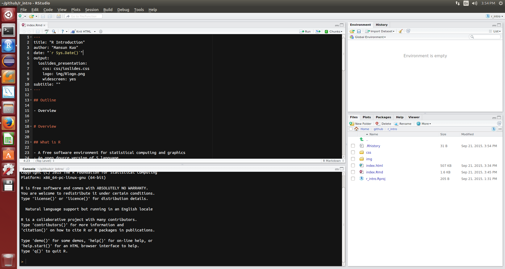

```{r include=FALSE}
library(knitr)
knitr::opts_chunk$set(warning = TRUE,
                      echo = TRUE,
                      message = TRUE,
                      # fig.align='center',
                      cache=TRUE)
```


## Outline

- Overview
- Data Structures
- Function
- Control Flow
- Miscellaneous
- References

# Overview

## What is R

- A free software environment for statistical computing and graphics
- An open dource version of S language
- An interpreted language builded with C, C++, Fortran and R
- A general-purpose scripting language
- Multi-paradigm
    - Procedual, Object-Oriented and Functional


## Why R

<div class="columns-2">

- It's free
- High-level functions/packages for analytic tasks
- Most popular analytic tool
- Communities with Statisticians, Analysts and Data Scientists
- To communicated with analyst / engineer
- Intergrated environment for reproducible research


[KDnuggets Poll 2015](http://www.kdnuggets.com/2015/05/poll-r-rapidminer-python-big-data-spark.html)

</div>


## Installation

You can use R in various environments:

- [Windows](https://www.youtube.com/watch?v=Ohnk9hcxf9M)  
    Download [base](https://cran.rstudio.com/bin/windows/base/) and 
    [Rtools](https://cran.rstudio.com/bin/windows/Rtools/)(optional) then install

- [Mac](https://www.youtube.com/watch?v=uxuuWXU-7UQ)  
    Download [R-x.x.x.pkg](https://cran.rstudio.com/bin/macosx/) and install
- Linux  
    You may use apt-get or yum to install your R environment  
    - [Ubuntu](https://cran.r-project.org/bin/linux/ubuntu/README)
    - [Red Hat](https://cran.r-project.org/bin/linux/redhat/README)

Using Linux or Mac may save your time with encoding issue.


## Rstudio

[Rstudio](https://www.rstudio.com/) 
is a powerful IDE that make you more confortable with R.


- [Rstudio Desktop](https://www.rstudio.com/products/rstudio/download/)

    A Rstudio IDE on your local machine. Download the installer of your OS and install it.
    [Here](https://www.youtube.com/watch?v=bM7Sfz-LADM) 
    is a video from 
    [Roger Peng](http://www.biostat.jhsph.edu/~rpeng/)
    about how to install RStudio on mac

- [Rstudio Server](https://www.rstudio.com/products/rstudio/download-server/)

    A Rstudio IDE Server on Linux platform. Download the installer and follow the instruction.


## How to get help

- `?`: Access ducument in R console
- `??`: Search the halp system
- google with appropriate keyword. For example:
    - R {package name}
    - R {algorithm name}
- Forum
    - [Taiwan R user Group](http://www.meetup.com/Taiwan-R/)  
      A free R/data analysis user group in Taiwan
    - [Stack Overflow](http://stackoverflow.com/questions/tagged/r)  
      A question and answer site for programmers
    - [PTT R_Language board](https://www.ptt.cc/bbs/R_Language/index.html)  
      A bbs forum for R in Taiwan


## Assignment

You may use `<-` or `=` to assign a value to a variable

```{r}
x <- 9.8
y = 689
z = x * 2 + y - (5 / 3^2)
z
```

Most [Programming Style Goude](http://adv-r.had.co.nz/Style.html)
would recommend using `<-` for assignment.

Please visit [here](http://adv-r.had.co.nz/Vocabulary.html) for more vocabulary in R.


## Working Environment

Using `getwd`/`setwd` to get/set your working directory.

```{r}
wd = getwd()
setwd("img")
getwd()
setwd(wd)
getwd()
```

If you [using Projects](https://support.rstudio.com/hc/en-us/articles/200526207-Using-Projects),
RStudio will change working directory for you automatically.


## Exercise: Hello R/RStudio

Let's have fun with R/RStudio




# Data Structures

## Basic Data Structure

Vector, Matrix, Array, List and Data frame are the most basic data structure in R.
These data structures can be mapped into a table according to:

- dimension
- Homogeneous or Heterogeneous of data type


<br> | Homogeneous     | Heterogeneous
---  | --------------- |-------------
1d   | Atomic vector   | List
2d   | Matrix          | Data frame
nd   | Array	


## Vector

Vector is a basic data structure in R. 
A scalar is a vector of length 1.


<div class="columns-2">

```{r}
v1 <- c(1:10)
v1
is.vector(v1)
length(v1)
s1 <- 2
s1
is.vector(s1)
length(s1)
```

</div>


## Type of Vector

Vector can contains several kinds of type.
Type describes how the object is stored in memory.
Elements in a vector will convert into looser types.

<div class="columns-2">

```{r}
logical_v = c(TRUE, FALSE, T, F)
typeof(logical_v)

int_v <- c(2L, 3L, 4L)
typeof(int_v)

numeric_v <- c(2.5, 3, pi)
typeof(numeric_v)

character_v = c("apple", "banana", 1)
typeof(character_v)
```

</div>


## Calculation with vector

Vectors can be calculated in the sense of [Array Programming](https://en.wikipedia.org/wiki/Array_programming).

```{r}
x <- 9.8
v1 <- 1:10
v1 * x
v2 <- c(rep(2, 5), rep(3,5))
v2
v1 + v2
```


## Recycle

If you calculate tow vectors with different length, 
the shorter vector will be recycled to the longer vector.

```{r}
v3 <- c(2, 3)
v1^v3
v4 <- c(2, 3, 4)
v1*v4
```


## Factor

A factor is a vector that can contain only predefined values, 
and is used to store categorical data.
Factors are widely used in various statically function(Ex: Regression, graphics, table) in R.

```{r}
gender <- c("Male", "Female", "Female", "Male")
gender <- factor(gender)
gender
```

<div class="columns-2">

```{r}
as.integer(gender)
as.character(gender)
```

</div>


## Named vector

A vector can have a name attribute.

```{r}
v5 <- c(1.2, 5, 8 , 12, 4.3, TRUE)
v5
names(v5) <- c("a", "b", "c", "d", "e", "f")
v5
attributes(v5)
```


## Subsetting: vector

you can subset a vector in a various way.

<div class="columns-2">

```{r}
v5[c(5, 2, 6)]
v5[-c(1, 3)]
v5[c("a", "f", "c")]
v5[c(T, F, F, T, F, T)]
v5[v5 >=7.5]
v5[v5 == max(v5)]
```

</div>


## Matrix

Matrix is a 2-dimenstion array. 
You can have various 
[matrix operation in R](http://www.statmethods.net/advstats/matrix.html).

```{r}
x <- matrix(c(2,1,3,2), nrow = 2, ncol = 2)
rownames(x) <- c("a", "b")
colnames(x) <- c("x", "y")
```

<div class="columns-2">

```{r}
# eigenvalue and eigenvector
eigen(x)
```

```{r}
# matrix multiplication and transpose
x %*% t(x)  
```
<br>
<br>

</div>


## Subsetting: matrix

You can subset a matrix in a various way.

<div class="columns-2">

```{r}
x[1, ]
x["b", ]
x["a", 2]
x[2, 1:2]
x[2, 2]
x["b", 2]
```

</div>


## List

Elements in a list can be any linds type and its length is arbitrary.
Function `str` can help you investigate the structure of a nested list.

<div class="columns-2">

```{r}
li <- list(a = 1:10, 
           b = c("apple", "banana"))
str(li)
```

<br>
<br>

```{r}
li2 <- list(li = li, 
            c = matrix(1:4, nrow = 2))
str(li2)
```

</div>


## Subsetting: list

You can subset a data frame in a various way.

<div class="columns-2">

```{r}
li2$li$a
li2$c
li2[[1]][[2]]
li2[["li"]][["b"]]
li2[["li"]][["b"]][2]
li2$li[[1]]
```
<br>

</div>


## Data Frame

Data frame is a 2-dimension data structure to deal with a table-like heterogeneous data.

```{r}
df <- data.frame(gender = c("male", "female", "female", "male"),
                 age = c(33, 18, 24, 26),
                 city = c("Taipei", "Taipei", "Hsinchu", "Taichung"))
```

<div class="columns-2">
```{r}
df
str(df)
```

</div>


## Subsetting: data frame

You can subset a data frame in a various way.
<br>

<div class="columns-2">

```{r}
df[c(1, 3), "city"]
df[3, c("gender", "age")]
df$gender[c(2,3)]
df[df$gender == "female", c(2, 3)]
```

</div>


## Recap: data structure

All data structures above are object.
They apply different methods and saved as different type internally.

```{r echo = FALSE}
x <- data.frame(object = c('c(1, 2.5, 3)', 
                           'c("male", "female", "female", "male")',
                           'factor(c("male", "female", "female", "male"))', 
                           'matrix(1:9, nrow = 3)',
                           'list(a = 1:10, b = c("apple", "banana"))',
                           'data.frame(a = 1, b = "z")'))
x$type <- sapply(parse(text = sprintf("typeof(%s)", x$object)), eval)
x$class <- sapply(parse(text = sprintf("class(%s)", x$object)), eval)
knitr::kable(x)
```


## Beyond basic data structure

- Use 
  [read.csv or read.table](https://stat.ethz.ch/R-manual/R-devel/library/utils/html/read.table.html) 
  to read a csv file or tab-separated file into data.frame.
- Use 
  [RODBC](https://cran.r-project.org/web/packages/RODBC/index.html),
  [RJDBC](https://cran.r-project.org/web/packages/RJDBC/index.html),
  [RMySQL](https://cran.r-project.org/web/packages/RMySQL/index.html) ...
  to read data from database
- Use 
  [jsonlite](https://cran.r-project.org/web/packages/jsonlite/index.html) or
  [rjson](https://cran.r-project.org/web/packages/rjson/index.html)
  to read a JSON file into list or data.frame.
- Use 
  [yaml](http://cran.fhcrc.org/web/packages/yaml/index.html)
  to read a yaml file into list.
- Use [XML](https://cran.r-project.org/web/packages/XML/index.html) to parse XML/HTML.
- Use 
  [reshape2](https://cran.r-project.org/web/packages/reshape2/index.html) and 
  [dplyr](https://cran.r-project.org/web/packages/dplyr/index.html)
  for merge, arrgegation, pivot and related data manipulation tasks.
- Use [data.table](http://mansunkuo.github.io/dsc2015_data.table/#1) for an enhanced version of data frame 
  and total solution of ETL.


## References

- [Advanced R](http://adv-r.had.co.nz/)
- [An Introduction to R](https://cran.r-project.org/doc/manuals/r-release/R-intro.html)
- [Quick-R](http://www.statmethods.net/)
- [R Programming](https://www.coursera.org/course/rprog)

